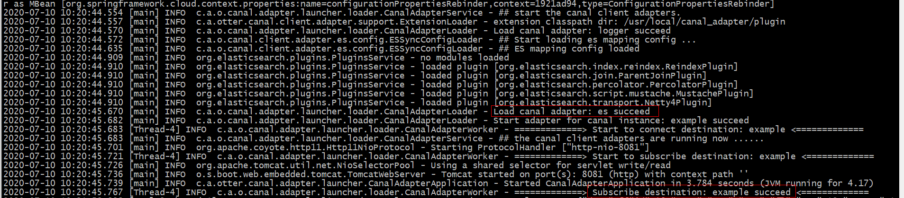
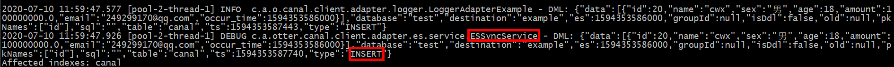
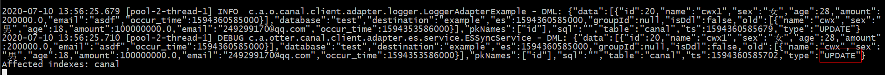
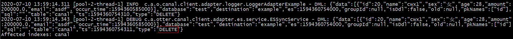

## canal 实现Mysql到Elasticsearch实时增量同步

参考：https://www.cnblogs.com/caoweixiong/p/11825303.html

###  `canal`官方已支持`Mysql`同步`ES6.X`

`canal`官方已支持`Mysql`同步`ES6.X`，需要借助adapter实现。。canal 1.1.1版本之后, 增加客户端数据落地的适配及启动功能。

`canal adapter` 的 ElasticSearch 版本支持6.x.x以上。

### 同步效果

1. 仅支持增量同步，不支持全量已有数据同步。这点，canal的初衷订位就是“阿里巴巴mysql数据库binlog的增量订阅&消费组件”。
2. 由于采用了binlog机制，Mysql中的新增、更新、删除操作，对应的Elasticsearch都能实时新增、更新、删除。
3. 推荐使用场景：canal适用于对于Mysql和Elasticsearch数据实时增、删、改要求高的业务场景。

### 环境

- debian8系统
- canal.deployer-1.1.4
- canal.adapter-1.1.4
- elasticsearch-6.2.4
- kibana-6.2.4

---

### 安装配置canal-adapter

- **adapter配置**

```bash
root@debian8:/usr/local/canal_adapter# cd conf/
root@debian8:/usr/local/canal_adapter/conf# ls
application.yml  bootstrap.yml  es  hbase  logback.xml  META-INF  rdb
root@debian8:/usr/local/canal_adapter/conf# vim application.yml 
  1 server:
  2   port: 8081
  3 spring:
  4   jackson:
  5     date-format: yyyy-MM-dd HH:mm:ss
  6     time-zone: GMT+8
  7     default-property-inclusion: non_null
  8 
  9 canal.conf:
 10   mode: tcp # kafka rocketMQ
 11   canalServerHost: 127.0.0.1:11111			# 指定canal-server的地址和端口
 12 #  zookeeperHosts: slave1:2181
 13 #  mqServers: 127.0.0.1:9092 #or rocketmq
 14 #  flatMessage: true
 15   batchSize: 500
 16   syncBatchSize: 1000
 17   retries: 0
 18   timeout:
 19   accessKey:
 20   secretKey:
 21   srcDataSources:					# 数据源配置，从哪里获取数据
 22     defaultDS:						# 指定一个名字，在ES的配置中会用到，唯一
 23       url: jdbc:mysql://127.0.0.1:3306/test?useUnicode=true
 24       username: canal
 25       password: canal
 26   canalAdapters:
 27   - instance: example # canal instance Name or mq topic name	# 指定在canal-server配置的实例
 28     groups:
 29     - groupId: g1
 30       outerAdapters:
 31       - name: logger
 32 #      - name: rdb
 33 #        key: mysql1
 34 #        properties:
 35 #          jdbc.driverClassName: com.mysql.jdbc.Driver
 36 #          jdbc.url: jdbc:mysql://127.0.0.1:3306/mytest2?useUnicode=true
 37 #          jdbc.username: root
 38 #          jdbc.password: 121212
 39 #      - name: rdb
 40 #        key: oracle1
 41 #        properties:
 42 #          jdbc.driverClassName: oracle.jdbc.OracleDriver
 43 #          jdbc.url: jdbc:oracle:thin:@localhost:49161:XE
 44 #          jdbc.username: mytest
 45 #          jdbc.password: m121212
 46 #      - name: rdb
 47 #        key: postgres1
 48 #        properties:
 49 #          jdbc.driverClassName: org.postgresql.Driver
 50 #          jdbc.url: jdbc:postgresql://localhost:5432/postgres
 51 #          jdbc.username: postgres
 52 #          jdbc.password: 121212
 53 #          threads: 1
 54 #          commitSize: 3000
 55 #      - name: hbase
 56 #        properties:
 57 #          hbase.zookeeper.quorum: 127.0.0.1
 58 #          hbase.zookeeper.property.clientPort: 2181
 59 #          zookeeper.znode.parent: /hbase
 60       - name: es
 61         hosts: 192.168.7.128:9300 # 127.0.0.1:9200 for rest mode
 62         properties:
 63           # mode: transport # or rest
 64           # security.auth: test:123456 #  only used for rest mode
 65           cluster.name: fjs-test    
```

- **es配置**

```bash
root@debian8:/usr/local/canal_adapter/conf/es# ls			# 这三个配置文件是自带的，可以删除，不过最好不要删除，因为可以参考他的格式
biz_order.yml  customer.yml  mytest_user.yml
```

创建`canal.yml`文件：

```
cp customer.yml canal.yml
vim conf/es/canal.yml

dataSourceKey: defaultDS   #指定数据源，这个值和adapter的application.yml文件中配置的srcDataSources值对应。
destination: example       #指定canal-server中配置的某个实例的名字，注意：我们可能配置多个实例，你要清楚的知道每个实例收集的是那些数据，不要瞎搞。
groupId: g1                #组ID，默认就好
esMapping:                 #ES的mapping（映射）
  _index: canal            #要同步到的ES的索引名称（自定义），需要自己在ES上创建哦！
  _type: _doc              #ES索引的类型名称（自定义）
  _id: _id                 #ES标示文档的唯一标示，通常对应数据表中的主键ID字段，注意我这里写成的是"_id"，有个下划线哦！  
  #pk: id                  #如果不需要_id, 则需要指定一个属性为主键属性  
  sql: "select t.id as _id, t.name, t.sex, t.age, t.amount, t.email, t.occur_time from canal t"   #这里就是数据表中的每个字段到ES索引中叫什么名字的sql映射，注意映射到es中的每个字段都要是唯一的，不能重复。  
  #etlCondition: "where t.occur_time>='{0}'"  
  commitBatch: 3000
```

sql映射文件写完之后，要去ES上面创建对应的索引和映射，映射要求要和sql文件的映射保持一致，即sql映射中有的字段在ES的索引映射中必须要有，否则同步会报字段错误，导致失败。

### 创建mysql表和es索引

```mysql
CREATE TABLE `canal` (
id int(11) NOT NULL AUTO_INCREMENT,
name varchar(20) NULL COMMENT '名称',
sex  varchar(2) NULL COMMENT '性别',
age  int NULL COMMENT '年龄',
amount decimal(12,2) NULL COMMENT '资产',
email  varchar(50) NULL COMMENT '邮箱',
occur_time timestamp NOT NULL DEFAULT CURRENT_TIMESTAMP,
PRIMARY KEY (`ID`)
) ENGINE=InnoDB AUTO_INCREMENT=3 DEFAULT CHARSET=utf8;
```


```
PUT /canal
{
    "mappings": {
        "_doc": {
            "properties": {
                "id": {
                    "type": "long"
                },
                "name": {
                    "type": "text"
                },
                "sex": {
                    "type": "text"
                },
                "age": {
                    "type": "long"
                },
                "amount": {
                    "type": "text"
                },
                "email": {
                    "type": "text"
                },
                "occur_time": {
                    "type": "date"
                }
            }
        }
    }
}
```

**启动`canal-adapter`**

```bash
root@debian8:/usr/local/canal_adapter/bin# sh startup.sh 
```

**查看日志**：

```bash
root@debian8:/usr/local/canal_adapter/logs/adapter# cat adapter.log 
```

如下图所示，`canal-adapter`与`ES`和`canal`成功建立了连接：



### 测试

通过`MySQL`插入一条数据：

```mysql
mysql> insert into canal(id,name,sex,age,amount,email,occur_time) values(null,'cwx','男',18,100000000,'249299170@qq.com',now());
Query OK, 1 row affected (0.31 sec)
```

查看`canal-adapter`的输出日志：



更新一条数据：

```mysql
mysql> update canal set name='cwx1',sex='女',age=28,amount=200000,email='asdf',occur_time=now() where id=20;
Query OK, 1 row affected (0.02 sec)
Rows matched: 1  Changed: 1  Warnings: 0
```

查看输出：



删除一条数据：

```mysql
mysql> delete from canal where id=20;
Query OK, 1 row affected (0.11 sec)
```

查看输出：



## 总结

- 全量更新不能实现，但是增删改都是可以的；

- 一定要提前创建好es索引；

- es配置的是tcp端口，比如默认的9300；

- 目前es支持6.x版本，不支持7.x版本；


